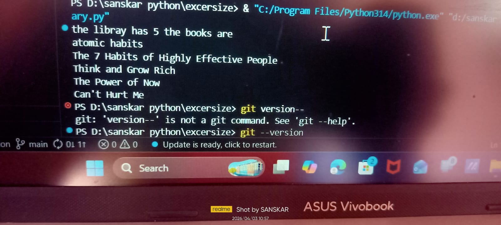

# 📚 Exercise Title  
Library Management System – Python Mini Exercise

---

## 🎯 One-Line Summary (Objective)  
To develop a Python-based Library Management System that allows users to manage books, issue/return records, and maintain basic library operations.

---

## 📚 Table of Contents  
<ul>
  <li><a href="#overview">Overview</a></li>
  <li><a href="#problem-statement">Problem Statement (Business Problem)</a></li>
  <li><a href="#tools--technologies-used">Tools & Technologies Used</a></li>
  <li><a href="#method">Method</a></li>
  <li><a href="#key-insights">Key Insights</a></li>
  <li><a href="#output">Output</a></li>
  <li><a href="#how-to-run-the-program">How to Run the Program</a></li>
  <li><a href="#result--conclusion">Result & Conclusion</a></li>
  <li><a href="#author--contact">Author & Contact</a></li>
</ul>

---

## 🧾 Overview  
  
This mini excersize is a console-based **Library Management System** built using Python.  

It allows users to:
- Add new books  
- View available books   

This project simulates how basic library operations are handled digitally and helps beginners understand structured program design.

---

## 🏢 Problem Statement (Business Problem)  
  
Managing books manually in a library can lead to inefficiencies, such as:
- Difficulty tracking issued books  
- Errors in record keeping  
- Time-consuming operations  

This system provides a simple digital solution to manage library activities efficiently.

---

## 🛠️ Tools & Technologies Used  
  
- Programming Language: Python  
- IDE: VS Code  
- Platform: Windows  
- Concepts Used: Lists, Functions, Conditional Statements, Loops  

---

## 🔧 Method  
  
1. Create a list to store book records  
2. Display menu options to the user  
3. Perform operations based on user choice:
   - Add Book  
   - Show Books  
4. Update records dynamically  
5. Repeat until user exits  

---

## 💡 Key Insights  
  
- Learned how to structure a real-world application  
- Practiced working with lists and functions  
- Improved logical thinking and program flow  
- Understood CRUD operations (Create, Read, Update, Delete)  

---

## 📤 Output  
  

### Program Output Screenshot  

> 📌 Replace `output.png` with your actual screenshot file name.  
> Make sure the image is uploaded in the same folder as this `README.md`.

---

## ▶️ How to Run the Program  
  

1. Install Python: https://www.python.org/downloads/  
2. Save your file as:
3. Run the program:

---

## ✅ Result & Conclusion  
  
This project successfully demonstrates:
- Real-world problem solving using Python  
- Basic data management system  
- Interactive console-based application  

It is a strong beginner-to-intermediate project suitable for GitHub portfolios.

---
🚀 **Have Suggestions to Improve This System?**  

I’m continuously improving my projects and would love your feedback!  

👉 Suggest features like database integration, GUI, or login system  
👉 Open to collaboration and real-world project ideas  
👉 Let’s build a more advanced version together  

💡 Your feedback can help make this project industry-level!  

---

⭐ If you found this project helpful, consider giving it a star on GitHub!
## 👨‍💻 Author & Contact  
  

**👤 Author:** Sanskar Bagal  

🔗 LinkedIn:  
https://www.linkedin.com/in/sanskar-bagal 

📧 Email:  
mailto:sanskarbagal2552@gmail.com  

---

